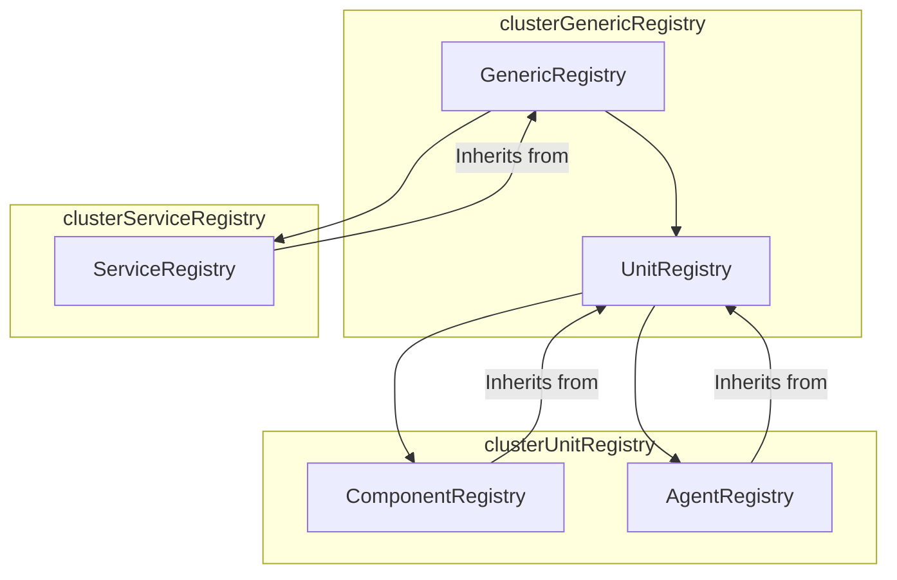
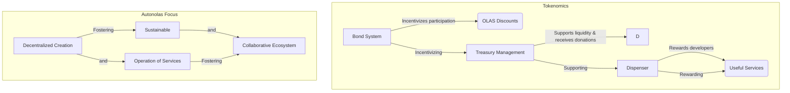
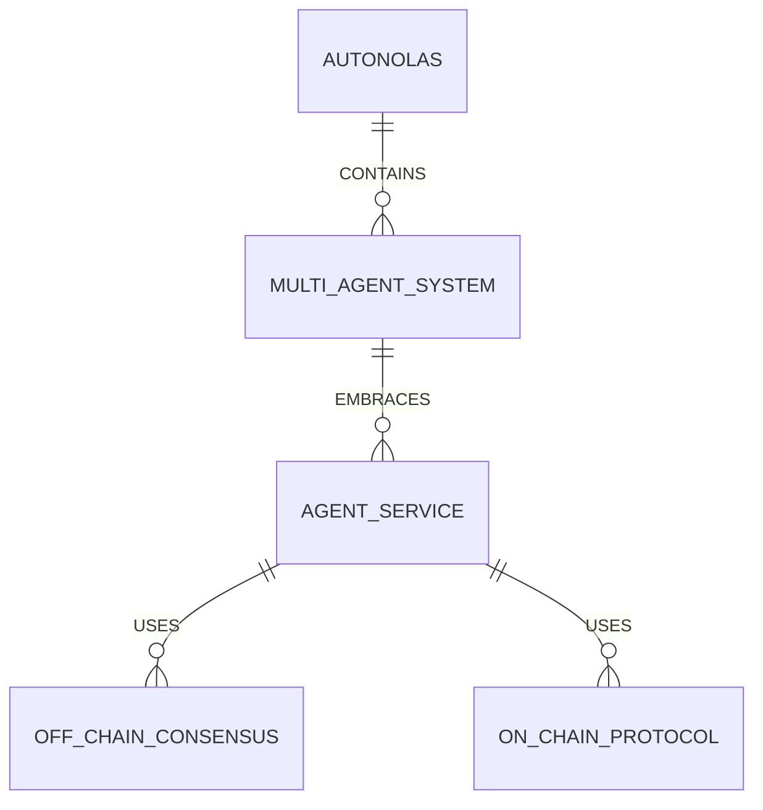

  

## Index

- [Index](#index)
- [1. A Comprehensive Overview](#1-a-comprehensive-overview)
- [2. The main contracts and the analyses of them](#2-the-main-contracts-and-the-analyses-of-them)
  - [Core Governance Contracts:](#core-governance-contracts)
    - [1. GovernorOlas.sol Contract](#1-governorolassol-contract)
      - [Purpose:](#purpose)
      - [Key Functionality:](#key-functionality)
      - [Utility:](#utility)
    - [2. Timelock.sol Contract](#2-timelocksol-contract)
    - [3. veOLAS.sol Contract](#3-veolassol-contract)
  - [Core Registries Contracts:](#core-registries-contracts)
  - [Tokenomics Contracts:](#tokenomics-contracts)
- [3. Autonolas Architecture](#3-autonolas-architecture)
- [4. Systemic Risks](#4-systemic-risks)
- [5. Security Approach of the Project](#5-security-approach-of-the-project)
- [6. Fresh Perspectives Unveiled by the Autonolas Initiative](#6-fresh-perspectives-unveiled-by-the-autonolas-initiative)

**The Process and Steps We Followed for Codebase Evaluation**

Our approach to analyzing the source code of the Autonolas Protocol was to simplify the information provided by the protocol, using a variety of diagrams to visually clarify the project's key contracts and break down each important part of these contracts. We identified the fundamental concepts and employed simpler language to explain the functionality and goals of the Autonolas Protocol and understand as well the purpuse of this audit.This enhances understanding for developers, security researchers, and users alike. Furthermore, we organized the information logically into separate sections, each with identifying titles, to provide a clear overall picture of the subject. Our primary goal was to make the information more accessible and easy to understand.

## 1. A Comprehensive Overview

**Olas** is a unified network for off-chain services like automation, oracles, co-owned AI. It offers a stack for building services and a protocol for incentivizing their creation and their operation in a co-owned and decentralized way.

## 2. The main contracts and the analyses of them
The protocol can be divided in three main parts --> governance, registries, and tokenomics. Let's take a closer look at the core contracts:

### Core Governance Contracts: 
******************************
> the key elements related to governance are the governance module, Timelock, and veOLAS token. 

#### 1. GovernorOlas.sol Contract
Note: This contract is the governance module contract.

##### Purpose:
The `GovernorOLAS` contract is designed to manage governance within the Autonolas protocol. Leveraging functionalities from the OpenZeppelin library (version 4.8.3), it implements a robust system for voting and executing proposals. This contract oversees the coordination of changes in protocol parameters, enabling community participation in key decisions.

##### Key Functionality:
  1. **Proposal Management:** Allows the creation, voting, and execution of proposals to alter protocol parameters. Participants can propose adjustments to contract addresses, values, and call data.

  2. **Time Control:** Implements a Timelock, meaning approved proposals do not execute immediately but after a specified period. This provides participants the opportunity to react and withdraw funds in case of undesired changes.

  3. **Weighted Voting:** Utilizes a governance token governance token in this case `veOLAS token` to grant voting power to participants. The weighting is based on the quantity of tokens they hold.

##### Utility:
- **Democratic Participation:** Enables governance token holders to actively participate in decision-making for the Autonolas protocol by voting on proposals and changes.

- **Security and Transparency:** The implementation of Timelock ensures security by ensuring that changes to the protocol do not happen immediately, allowing participants to take action if necessary.

- **Compatibility and Extensibility:** The contract is compatible with various OpenZeppelin governance extensions, facilitating the incorporation of new functionalities and ensuring the integrity of the governance system.

> 👀➡️ This contract is pivotal for effective governance within Autonolas, providing the community with a transparent and secure mechanism to influence the development and evolution of the protocol.

#### 2. Timelock.sol Contract
The main utility of the Timelock contract is usable within the Autonolas ecosystem as a central tool to manage the time between the approval and implementation of governance proposals. Its utility lies in providing a secure and predictable mechanism for community decision-making, enabling informed participation, and the opportunity to withdraw funds in case of undesired changes.

> This contract serves as a key component in the governance design of Autonolas, facilitating the effective implementation of changes through a deliberate and secure process.

#### 3. veOLAS.sol Contract
The veOLAS smart contract is designed to manage a weighted voting system within the Autonolas protocol. $OLAS holders can lock their OLAS tokens to receive a virtualized governance right called veOLAS. 

> We understand the main purpuse of the logic apply to this contract aims to create alignment and long-term commitment between $OLAS holders and the Autonolas protocol, fostering retention and active governance participation through the $veOLAS mechanism.🚨veOLAS is non-negotiable, virtual, and non-delegable, providing exclusive governance participation rights to veOLAS holders.

  1. **Time-Weighted Voting:**
     - Voting weight is based on the time during which $OLAS tokens are locked. The longer they are locked, the higher the voting weight.

  2. **Linear Decay:**
     - Voting weight linearly decreases over time. This feature motivates users to lock their tokens for longer periods to maximize their voting power.

  3. **Time and Amount Limits:**
     - Time and quantity limits are imposed to ensure security and prevent overflows. For example, the maximum lock time is limited to 4 years (MAXTIME). There are also limits on the amount of deposited tokens and increments, ensuring that unchecked operations of adding amounts are safe.

  4. **veOLAS as Governance Right:**
     - Only $veOLAS holders can participate in the Autonolas DAO governance. This limits short-term decision-making compared to a model with a tradable governance token.

  5. **Retention Incentives:**
     - Incentivizes long-term retention of $OLAS by granting more voting power to those who lock their tokens for extended periods. This aligns holders' interests with the protocol's stability and long-term success.

### Core Registries Contracts:
******************************
> Core smart contracts are permissionless. Autonolas governance controls the process of service management functionalities and of minting new NFTs representing components and agents (i.e. it can change the minting rules and pause minting). The remaining functionalities, in particular `transfer functionalities`, are not pausable by governance.

The core smart contracts of Autonolas consist of five interconnected components. Firstly, `GenericRegistry.sol` acts as an abstract contract serving as a template for creating generic registries. `UnitRegistry.sol`, in turn, is an abstract contract inheriting from GenericRegistry and functions as a template for creating generic agents and components. Two concrete contracts, `ComponentRegistry.sol` and `AgentRegistry.sol`, derive from UnitRegistry and respectively represent agent components and agents themselves by issuing NFTs. Additionally, `ServiceRegistry.sol`, an ERC-721 contract inheriting from GenericRegistry, is used to represent services and provides utility methods for service management.
> 🚨 note: For this contest the ServiceRegistry.sol contract is out of scope but for us it makes sense to mention in the components because helps know all the context about core contracts

These smart contracts are intertwined to enable the creation, management, and unique representation as NFTs of agents, components, and services on the Autonolas platform, offering a robust framework for the core functionality of the protocol. Here is a simple example of how the contracts interact with each other:

### Tokenomics Contracts:
**************************
> In Autonolas' tokenomics architecture, smart contracts interact synergistically to implement the protocol's economic model. 

At the highest level, the main `Tokenomics.sol` contract establishes the fundamental mathematical logic for estimating the potential code production and on-chain metrics, another note to add is if you wanna understand deeply this contract the team made a great job with the docs specially with [this one](https://github.com/code-423n4/2023-12-autonolas/blob/main/tokenomics/contracts/Tokenomics.sol). The `Depositor.sol` contract enables users to deposit LP-tokens, creating bonds that grant discounts on $OLAS upon maturity and this contract borrows the logic to calculate the discount from the tokenomics contract. 

Additionally, the `Treasury.sol` contract manages the protocol's Treasury, allowing the Depository contract to deposit assets and handle donations. This contract borrows concepts from [OlympusDAO](https://docs.olympusdao.finance/main/technical/overview#protocol-architecture) and contains the logic for the management of the Autonolas protocol Treasury. It allows the Depository contract to deposit LP-tokens assets in exchange for $OLAS tokens. Also contains the logic to receive donations from Protocol-owned Services and to transfer tokens from the Treasury reserves. Finally, it has a management role in the Depository, Dispenser, and Tokenomic contracts.

The `Dispenser.sol` contract facilitates NFT owners of agents/components to claim incentives, interacting with the Tokenomics contract to calculate and distribute these rewards. 

Collectively, this modular and collaborative structure enables Autonolas to effectively manage the growth of its capital and useful code while consistently providing incentives to network participants. All the components looks like this:

## 3. Autonolas Architecture
> This is the flow of the Autonolas Architecture:

## 4. Systemic Risks
> As we delve into the intricacies of Autonolas' contracts and documentation, we cannot overlook certain risk indicators that warrant closer scrutiny, we encountered questions where we could highlight certain aspects that we find important regarding potential systemic risks

Firstly, the decentralized governance model, while empowering, could potentially slow down decision-making or the efficient implementation of changes. Achieving unanimous agreement is crucial, but reaching a consensus sometimes feels like herding cats.

Let's also discuss the reliance on third-party contracts, such as OpenZeppelin. Although they have contributed tremendous value to the crypto world, any unexpected adjustments to these contracts could catch us off guard, unleashing chaos in Autonolas' functionality, another thing is the OZ version used in the protocol is 4.8.3, we recommended use always the [lastest version](https://github.com/OpenZeppelin/openzeppelin-contracts/releases/tag/v5.0.1). And don't even get us started on the weighted voting system. Sure, it's a clever concept, but what if people start playing chess with their tokens, strategically locking and unlocking them to maximise their influence?

Next, we confront the thorny issue of liquidity management. Imagine Autonolas running out of steam. That could complicate things, making it challenging to deliver rewards and, quite frankly, turning the party a bit dull. And let's not even talk about the intricate tokenomics: bonds, rewards – it's like walking on a tightrope. If the incentives aren't enticing enough or if people don't keep up with the expected pace, things could get a bit peculiar.

Additionally, it's important to note that the audit scope of the contracts is 100%, but we recommend creating a test suite of invariants and fuzzing tests in the future to enhance project security and validate code robustness.

In a nutshell,, Autonolas is like the new crypto rockstar, but, as in any great adventure, we need to stay vigilant for potential challenges. It's a bit like sailing through uncharted waters: thrilling, but with some sea monsters lurking. Stay alert, friends!

## 5. Security Approach of the Project
What the project can add in the understanding of security:

- After the Code4rena audit is completed and the project is live, I recommend the audit process to continue, projects like [immunefi](https://immunefi.com/) and [Code4rena Blue](https://code4rena.com/how-it-works/blue) program.

## 6. Fresh Perspectives Unveiled by the Autonolas Initiative
As we delved into the intricacies of Autonolas, two aspects exceptionally captured our attention. Firstly, the ingenious bonding model within the Depositor contract stands out as a clever tactic to incentivize participation and promote liquidity retention. The intersection of financial incentives and long-term stability intrigued and motivated us to delve into the unique dynamics it forges between users and the Autonolas ecosystem.

Additionally, the veOLAS voting token mechanism emerged as a gem in decentralized governance. By linking voting power to the locking duration of $OLAS tokens, Autonolas propels long-term participation and rewards ongoing dedication. This weighted approach adds a layer of sophistication to democracy in the protocol, sparking our curiosity about its influence on community decisions.

### Time spent:
25 hours